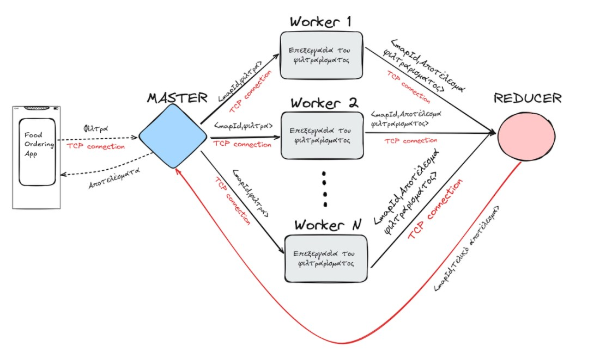

# Distributed Food Ordering System (Java).
*Athens University Of Business 2025*

### [▶ Video Presentation](https://www.youtube.com/watch?v=sbULFQ-iN-8)

<br>


##### (For the Android Application Repository [click here](https://github.com/odimos/FoodApp))

#### Distributed Java backend system managing stores and menus, providing sales statistics, while supporting user-facing browsing, ordering, and ratings via an Android app, designed to support multiple concurrent clients.

The project focuses on:
- Distributed system design
- Multithreaded request handling
- Thread coordination and data consistency
- Client–server communication over TCP sockets

The backend is implemented in Java and follows a distributed Master–Worker architecture with a custom MapReduce process.

### Architecture
- Clients connect to the **Master** node with TCP sockets.
- The Master distributes tasks to multiple **Worker** nodes, which may run on different machines.
- Each Worker processes tasks in parallel using a multithreaded architecture.
- Partial results are sent to the **Reducer**, which merges them into the final result and returns it to the master.
- Master returns the final result to Client.
- All nodes communicate with TCP sockets.

A custom MapReduce process distributes store and product queries across workers and aggregates results at the Reducer.

### Request Flow

1. Client sends a request to the Master
2. Master splits the workload and dispatches tasks to Workers
3. Workers process tasks in parallel
4. Reducer aggregates partial results
5. Master returns the final response to the client

### Client / Server Communication

All communication between nodes follows a client–server model over TCP sockets, implemented with shared Client and Server classes.
### Client → Server
App, Manager -> Master
Master -> Workers
Master -> Reducer 
Reducer -> Workers

### Concurrency & Synchronization

- Parallelism is achieved using Java threads.
- Thread coordination uses the `wait()` / `notify()` mechanism.
- Data consistency is ensured with `synchronized` methods and synchronized blocks.

### Data

Each Worker node stores a collection of Store objects.  
A Store contains Product objects, Sale objects, logo image bytes, and other data.

## Technologies 

- Language: Java
- Networking: TCP Sockets
- Serialization: Java Serialization
- Concurrency: Threads with `wait()` / `notify()`
- Storage: In-memory only
- External Libraries: None (standard Java libraries only)

## Client / Server Abstraction

TCP communication is implemented using shared `Client` and `Server` classes.  
Both classes are generic and receive a type parameter `M` that extends a handler interface.

- `Client<M extends ResponseHandler>`
- `Server<M extends RequestHandler>`

The handler instance is passed during construction and represents the node that owns the connection (Master, Worker or Reducer).

For the client:
- `Client` manages the socket connection and message exchange.
- Received responses are forwarded to the handler via `handleResponseFromServer(...)`.

For the server:
- `Server` listens for incoming connections and reads requests.
- Each request is forwarded to the handler via `handleRequest(...)`.

The actual request/response handling logic is implemented in the owning node class, not inside `Client` or `Server`.

## Ordering Application

The ordering app is written with  Kotlin coroutines and Java threads for asynchronous execution.
The UI is implemented with Jetpack Compose. 
[Android Application Repo](https://github.com/odimos/FoodApp)

## Manager Capabilities
- Add and remove stores
- Add and remove available products
- Update product stock
- View sales statistics

## Application Capabilities
- View available stores
- Filter stores based on options
- Purchase a selected quantity of a product

## Scope & Limitations
- No persistent storage (in-memory only)
- No fault tolerance or node recovery
- Static configuration of nodes and ports

## How to Run

1. **Configure networking**
   - Set the correct IP addresses and ports for all system components.
   - Ensure all nodes are reachable over the network.
   
2. **Compile the source code**
   Compile java files in the main directory and in the `data` directory:
     ```bash
     javac *.java data/*.java
     ```

3. **Start backend components**  
   The startup order does not matter.
   ```bash
   java Master
   java WorkerNode <id> <port> # put any id you want, a rule of thumb is to give ids in order: 1,2,3..
   ...  # start all workers in their respective environment
   java Reducer
   ```

4. **Initialize data**
     ```bash
     java Manager
     ```
5. **Run the application**
    Use the [App](https://github.com/odimos/Distributed-System-Food-Ordering) to browse available stores and place orders.

## Common issues 

- **Thread blocking due to console input**
  - Avoid clicking or selecting terminal output while nodes are running.
  - Some terminals block the JVM thread when text is selected, causing the system to appear frozen.
  - This can stall socket communication and worker execution.

- **Blocked or unreachable ports**
  - Ensure the selected ports are open and not used by other processes.
  - Firewalls or OS security settings may block TCP connections.

- **Incorrect IP configuration**
  - Do not confuse internal (LAN) and external IP addresses.
  - All nodes must be on the same network or explicitly routable.

- **Nodes on different networks**
  - Running components on different machines or VMs requires proper network bridging or port forwarding.
  - NAT configurations may prevent direct TCP connections.

- **Silent connection failures**
  - A missing or incorrect port/IP may cause a node to block while waiting for a connection.
  - Check logs, and write your own if needed, on both client and server sides when no output is produced.